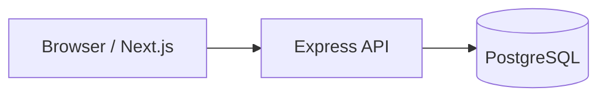
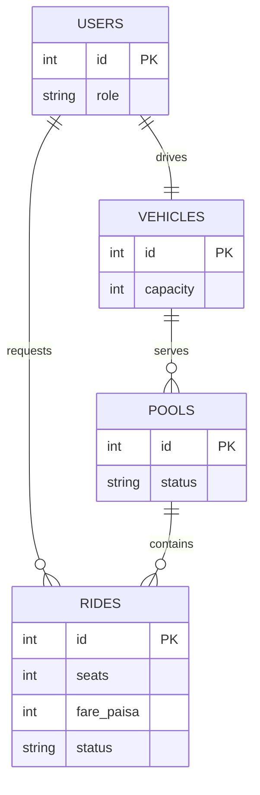

# Dhaka Tesla Pool

A runnable MVP for pooled rides in Dhaka. Passengers request rides, are matched into a compatible pool when seats are available, receive individual fares, and can track their ride. Drivers can see the pool and progress its lifecycle.

## Quick start

```bash
docker compose up --build
```

Open `http://localhost:3000`.

Demo accounts: Nusrat (`nusrat@tesla.local`), Rafiq (`rafiq@tesla.local`), Shirin (`shirin@tesla.local`), and driver Jashim (`jashim@tesla.local`). Password is `demo123` for every account.

## Architecture



## ERD



## Product rules

- Compatible requests have the same pickup zone; Banani to Mohakhali/Gulshan 1 is treated as compatible.
- Bullet has three seats. `reserveRide` uses a PostgreSQL transaction with `SELECT ... FOR UPDATE`, so concurrent requests cannot overbook it.
- Fare is stored in integer paisa: `base 8000 + 1500 per km - 2000 pool discount`.
- Ride lifecycle: `MATCHED -> DRIVER_ARRIVED -> STARTED -> COMPLETED`; cancellation is allowed before `STARTED`.

## API

- `POST /api/auth/login` - demo login
- `GET /api/rides?userId=` - passenger rides
- `POST /api/rides` - create/match a request
- `POST /api/rides/:id/cancel` - cancel before start
- `GET /api/driver/pool?driverId=` - driver pool
- `POST /api/pools/:id/status` - lifecycle change

## Technology choices

Next.js provides the simple UI and routing. Express keeps the API explicit and easy to test. PostgreSQL is used because capacity allocation and status transitions need transactions and relational constraints. Docker Compose makes the three services reproducible.

## AI usage

AI assistance was used to accelerate boilerplate and explain implementation choices. The accepted suggestion was using a transactional seat-reservation query. A suggestion to add Redis/Kafka was rejected because a single MVP database transaction solves the current concurrency problem without unnecessary infrastructure.
